# Praktikum-4

# Latihan Membuat List

1. Membuat list sebanyak 5 elemen.
2. Disini saya akan membuat 5 elemen tersebut dengan angka genap (2,4,6,8,10).
3. lalu kita cetak variable yg kita gunakan, untuk menampilkan list yang kita buat. berikut contoh programnya :

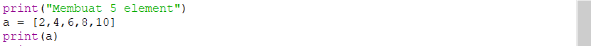

1. Menampilkan elemen k-3 dari list
2. Disini saya akan menampilkan elemen ke 3 dari 5 data list yang sebelumnya telah dibuat yaitu(2,4,6,8,10), nah data yang akan ditampilkan adalah angka 6.
3. Kita ketikan variabelnya lalu ditambah angka [2] harus dalam kurung siku, 2 disini berfungsi untuk menampilkan elemen setelah elemen ke 2. Berikut sebagai contoh programnya 

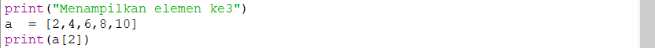

1. Mengambil/menampilkan elemen ke 2 sampai ke 4 dari ke 5 elemen tersebut
2. Nah jika menampilkan beberapa elemen kita perlu tanda : sebagai range.
3. Kita cetak variabel a nya

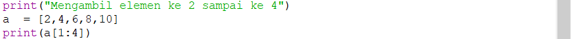

1. Mengambil elemen terakhir
2. Agar bisa mengambil nilai elemen yg terakhir, caranya seperti yg no 2 yaitu kita cetak variabelnya dan masukan urutan angka sebelum angka terakhir yaitu 4. Maka programnya seperti berikut :

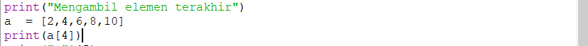

1. Mengubah elemen ke 4
2. Untuk mengubah suatu elemen kita hanya perlu membut suatu deklarasi a[3]=9
maka elemen ke 4 akan di hbah menjadi angka 9.

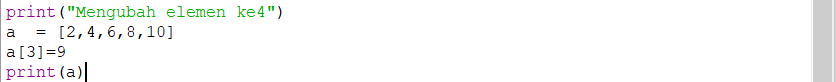

1. Mengubah elemen ke 4 sampai terakhir
2. Untuk mengubah beberapa elemen kita perlu menentukan range deklarasi a[3:5]=16,20 maka elemen ke 4 - terakhir akan diubah menjadi angka 16, 20.
3. Berikut contoh program nya

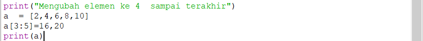

1. Mengambil 2 bagian dari list a menjadi list b
2. Caranya seperti kita membuat elemen baru, tapi data yang dimasukan mengambil dari elemen a. berikut contoh programnya

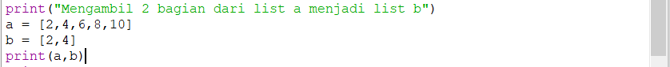

1. Menambahkan list b dengan nilai string
2. Untuk menambahkan nilai string kita membutuhkan fungsi append, append ini berfungsi untuk menambahkan satu elemen. Berikut contoh programnya :

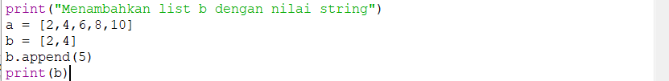

1. Menambhakan list b dengan 3 nilai
2. Untuk menambahkan 3 nilai kita membutuhkan fungsi extend, yang berfungsi untuk menambahkan beberapa elemen. Berikut contohnya :

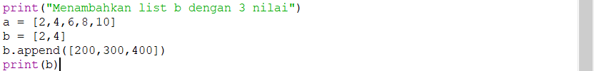

1. Menggabungkan list b dengan list a
2. untuk menggabungkan list b dan a, kita perlu membuat list baru yaitu c untuk menampilkan list b dan a. caranya kita hanya perlu menjumlahkan list b dan a. Contohnya seperti berikut : 

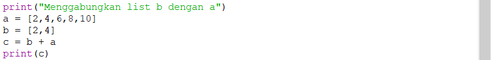

Berikut adalah hasil tampilan dari semua program diatas :

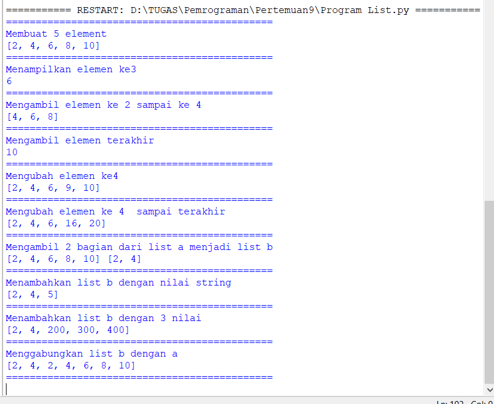

# Menambahakan Data Kedalam Sebuah List

1. Pertama kita buka aplikasi python dan buka new file
2. Kita gunakan Perulangan while untuk membuat input data mahasiswanya. Berikut Contoh programnya :

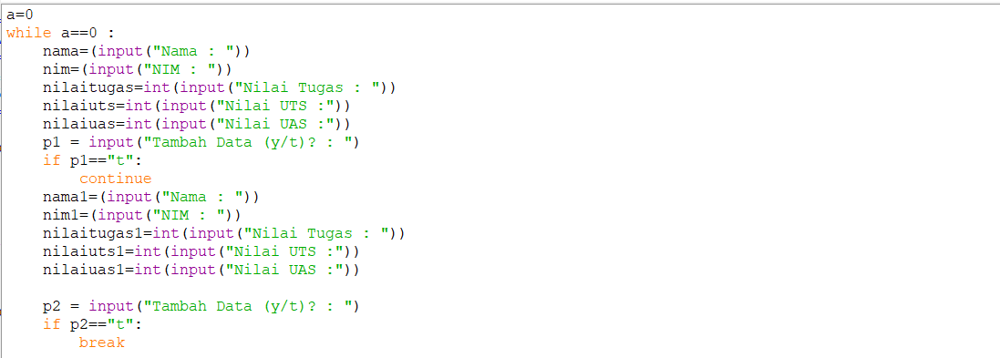

3. Setelah membuatinput data mahasiswa kita buat data list dari data yang telah diinputkan sebelumnya. Berikut contoh programnya :

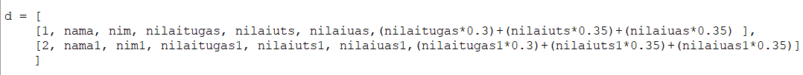

4. Setelah membuat data list, lalu kita membuat program untuk menampilkan data mahasiswa yang kita inputkan dalam bentuk tabel.
5. pada program ini saya menggunakan perulangan for untuk menampilkan datanya.
6. untuk membuat tabelnya saya menggunakan fungsi center untuk menampilkan data berada di tengah dan juga menggunakan beberapa simbol seperti "=" dan "|" untuk memberi jarak.

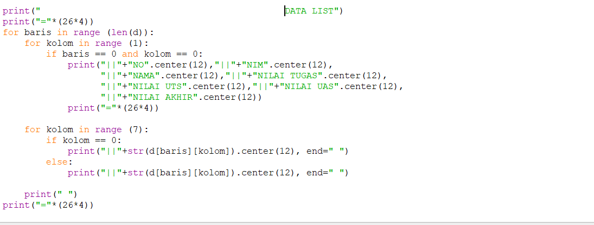

7. berikut program keseluruhannya dan tampilan progrmnya : 

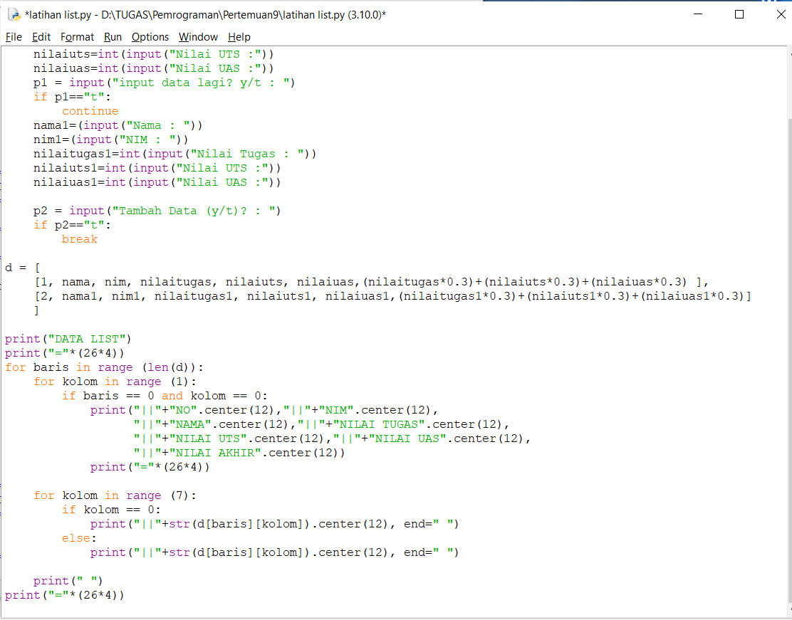

8. Hasil program yang sasya buat :

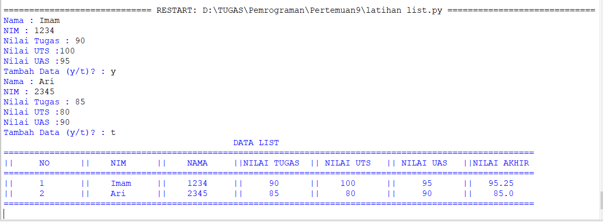